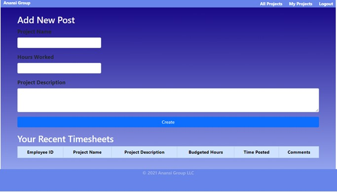
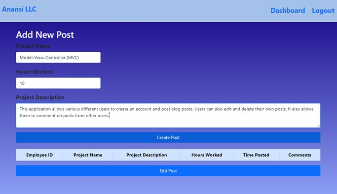
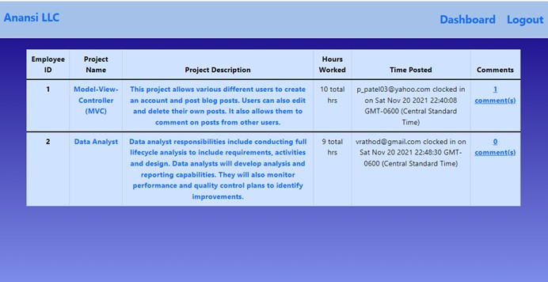

# Anansi
## Description
This project serves as a platform where employees can post their work done of different projects.  
Employees can record their time spent on that project
Employees can comment and create new timesheets. 
When they are logged in, they can view every timesheet 
Each  employee posted by clicking the dashboard. 

## Technology Use

* MySQL
* Javascript
* Node.js
* dotenv 
* Handlebars
* MYSQL 2
* nodemon
* Insomnia

# Installation used
* Express
* mysql2
* Bcrypt
* Handlebars
* dotenv 
* Session
# Screenshot : 

# Link
https://anansi-inc.herokuapp.com/
# Repository
https://github.com/Sethhixon92/Anansi
# Contributors 
 Ken Ilochonwu, Paul Barcenas, Priti Patel, Seth Hixon
 
